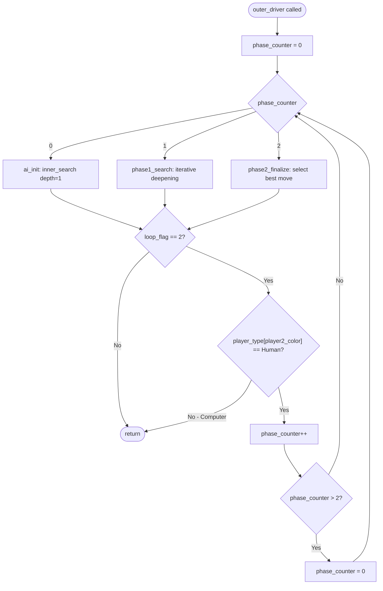
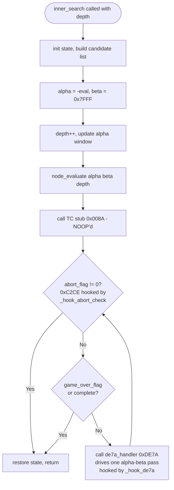
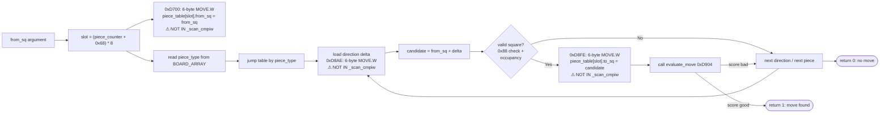
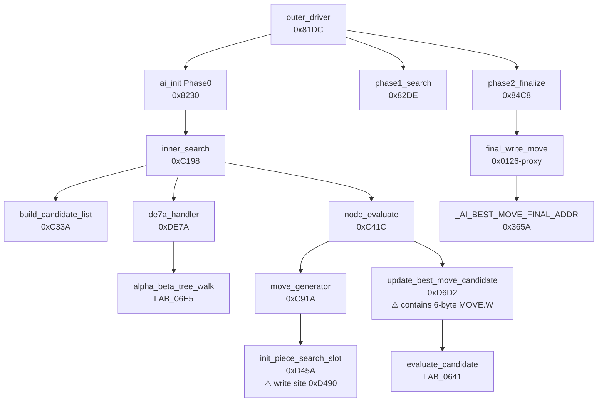

# Battle Chess Amiga — AI Engine Map

**Purpose:** Complete reference document for the headless M68K emulation of the Battle Chess Amiga AI.
Precise enough to (a) fix the current emulation bug and (b) serve as the specification for a future
Python reimplementation of the engine.

**Security:** This document contains pseudo-code, data layouts, and address annotations derived from
disassembly. No raw assembly source, hex byte sequences, or disassembled code segments are included —
only algorithm descriptions and structural data.

---

## 1. Board Representation

### 1.1 0x88 Square Encoding

Battle Chess uses the standard 0x88 board representation:

- A square index is a 7-bit value formed as `rank * 16 + file` (rank and file both 0–7).
- Valid squares range from `0x00` (a1) to `0x77` (h8).
- Off-board detection: a square is **invalid** if `sq & 0x88 != 0` (bit 3 or bit 7 is set).
  This allows cheap legality testing: adding any direction delta and masking with `0x88` detects
  wrap-around without a branch.

Square examples:
| Square | 0x88 index | Note |
|---|---|---|
| a1 | 0x00 | White queen-side rook start |
| e1 | 0x04 | White king start |
| e2 | 0x14 | White king's pawn |
| e4 | 0x34 | After e2e4 |
| e7 | 0x64 | Black king's pawn start |
| h8 | 0x77 | Black king-side rook |

### 1.2 Board Array (`BOARD_ARRAY_ADDR = 0x30F4`)

A flat array of 128 × 4-byte entries. Each entry for square `sq`:

| Byte offset | Field | Encoding |
|---|---|---|
| `sq * 4 + 0` | piece_type | 0=empty, 1=King, 2=Queen, 3=Rook, 4=Bishop, 5=Knight, 6=Pawn |
| `sq * 4 + 1` | color | 0=White, 1=Black |
| `sq * 4 + 2` | reserved | 0 |
| `sq * 4 + 3` | reserved | 0 |

Total size: 512 bytes. Only valid 0x88 squares (0x00–0x77) are meaningful.

### 1.3 Piece Table (`PIECE_TABLE_ADDR = 0x3322`)

A flat array of up to 32 entries (16 per side), each 8 bytes. The search engine maintains one entry
per piece currently in play. Indexed from base `0x3322`:

```
struct PieceEntry {          // 8 bytes per entry, big-endian
    uint16_t  to_sq;         // offset +0: destination square (0 = unset, filled during search)
    uint16_t  from_sq;       // offset +2: current piece position (set by write_position)
    uint16_t  search_state;  // offset +4: internal search flag (0 = ready)
    uint8_t   reserved_6;    // offset +6: internal, written by move-gen
    uint8_t   reserved_7;    // offset +7: piece_type copy (written by init_piece_search_slot)
}
```

### 1.4 AI Best-Move Address (`AI_BEST_MOVE_ADDR = 0x3662`)

This is NOT a separate buffer. It is `PIECE_TABLE_ADDR + 0x68 * 8` — the slot for the notional
piece at table index 0x68. The search uses this as the "best move found so far" accumulator:

| Address | Field | Note |
|---|---|---|
| `0x3662` | to_sq (word) | Destination square of best move |
| `0x3664` | from_sq (word) | Source square of best move |
| `0x3666` | search_state (word) | Internal |
| `0x3668–0x3669` | reserved | Internal |

`AI_BEST_MOVE_FINAL_ADDR = 0x365A` is 8 bytes earlier in the table (slot 0x67); it is used by the
phase-2 final-selection pass (different field order: from_sq at +0, to_sq at +2).

---

## 2. Data Structures and Control Flags

### 2.1 Key BSS/Global Addresses

| Address | Name | Purpose |
|---|---|---|
| `0x3320` | `PIECE_COUNTER_ADDR` | Current piece-table iteration index; −1 = ready for search |
| `0x331E` | `PLAYER1_COLOR_ADDR` | Color of player 1 (0=White, 1=Black) |
| `0x331C` | `PLAYER2_COLOR_ADDR` | Color of player 2 (0=White, 1=Black) |
| `0x4A4A` | `ABORT_FLAG_ADDR` | Non-zero → inner search exits at next abort-check node |
| `0x4A5A` | `LOOP_FLAG_ADDR` | Must be 2 for outer driver to run next phase |
| `0x4A92` | `WAIT_FLAG_ADDR` | Timer wait flag; zero before search |
| `0x48BA` | `PHASE1_EVAL_CTR_ADDR` | Phase-1 evaluation counter; 0 to enable search |
| `0x07D2` | `AI_INIT_PATH_FLAG_ADDR` | 0 = clean init path (depth-1 call to 0xC198) |
| `0x8270` | `SEARCH_COMPLETE_FLAG_ADDR` | 0 = allow search; non-zero = skip inner loop immediately |
| `0x07D4` | `PLAYER_TYPE_BASE` | Array indexed by color*2: 1=Human, 2=Computer |

### 2.2 BSS Range (`0x3000–0x5FFE`)

The game's own startup initialises this to the sentinel value `0x0278` (used as "empty entry" in
the transposition/hash table). Because the BSS-init routine (0x8820) is bypassed in the headless
emulation, Python must pre-fill this region before each search:

```python
cpu.mem_write(0x3000, b"\x02\x78" * (0x3000 // 2))  # 0x3000 bytes
```

`write_position()` then overwrites `BOARD_ARRAY_ADDR` and `PIECE_TABLE_ADDR` with live position data.

### 2.3 Search Stack

The search engine uses the piece table as an implicit stack. During the search, the AI iterates
through piece entries 0–N (up to 32 pieces). For each piece, it sets `PIECE_COUNTER_ADDR = piece_idx`
and then calls `update_best_move_candidate()`, which operates on slot `piece_counter + 0x68`.

The search stack entries are:

- Slots 0x00–0x1F: actual piece entries (written by `write_position`)
- Slots 0x67 and 0x68: best-move accumulators (used by phase 0 and phase 2)
- The "search stack" in a traditional alpha-beta sense is managed via the A5 call frame stack

---

## 3. Algorithm Pseudo-Code

### 3.1 `outer_driver()` — at 0x81DC

The iterative-deepening controller. Called once by the Amiga UI; loops through phases.

```c
/* 0x81DC: outer_driver() */
void outer_driver() {
    int phase_counter = 0;                      // [A4 - 0x35A2] = 0 initially
    
    while (true) {
        switch (phase_counter) {                // 0x8200: dispatch on phase
            case 0:  ai_init();          break; // 0x81F0: BSR ai_init (0x8230)
            case 1:  phase1_search();   break;  // 0x81F4: JSR phase1_search (0x82DE)
            case 2:  phase2_finalize(); break;  // 0x81FA: JSR phase2_finalize (0x84C8)
        }
        
        // 0x820C: check loop flag — must be 2 to continue
        if (loop_flag != 2) break;              // [0x4A5A] != 2 → exit
        
        // 0x8214–0x8226: check player type for next phase
        // 6-byte CMPI.W #1, (player_type_base + player2_color*2) — patched by _hook_player_check
        int next_phase_player = player_type_table[player2_color];
        if (next_phase_player != 1 /*Human*/) break;
        
        // 0x81E4: increment phase and loop
        phase_counter++;
        if (phase_counter > 2) phase_counter = 0;
    }
}
```

**Note on 0x8220**: `CMPI.W #1, (0, A0, D0.L)` is a 6-byte instruction mis-decoded by Unicorn.
It is patched by `_hook_player_check` in `Think.py`.

**Note on 0x820C**: `CMPI.W #2, (loop_flag)` is also a 6-byte instruction. Patched by `_hook_loop_check`.

### 3.2 `ai_init()` — at 0x8230 (Phase 0)

The phase-0 inner search driver. Invokes `inner_search()` for one depth-1 pass.

```c
/* 0x8230: ai_init() — Phase 0 of the outer driver */
void ai_init() {
    init_move_tables();         // 0x8234: JSR 0x882A (fills direction deltas, etc.)
    init_board_state();         // 0x8238: JSR 0x8D28 (sets board evaluation baseline)
    reset_hash_table();         // 0x823C: JSR 0x7E6E (reset transposition table)
    init_piece_evaluation();    // 0x8240: JSR 0x856E (piece score init)
    clear(piece_counter);       // 0x8244: CLR.W [0x3320]
    clear(phase_eval_ctr);      // 0x8248: CLR.W [0x92B8] (some eval counter)
    
    if (ai_init_path_flag == 0) {        // 0x824C: TST.W [0x07D2] — clean path
        clear([0x4A50]);                 // 0x8252: CLR.W
        push(1); call inner_search();    // 0x8256–0x825E: MOVE.W #1, -(A7); JSR 0xC198
        // fall through to post-search setup
    } else {
        // dirty path (0x8262+): calls alternate pawn-promotion search with OS stubs
        // not available in headless mode — force ai_init_path_flag = 0 always
    }
    
    // 0x82C4 (LAB_03AF): post-search state update
    write(-1, phase_eval_ctr);           // MOVE.W #0xFFFF, [A4-0x4CDE]
    write(1, outer_phase_counter);       // MOVE.W #1, [A4-0x35A2]
    call phase1_setup_func();            // JSR 0x8856
}
```

### 3.3 `inner_search()` — at 0xC198 (Alpha-Beta Loop)

The core search entry point. Called with search depth on the stack.

```c
/* 0xC198: inner_search(int depth) */
int inner_search(int depth) {
    copy_player_state();                        // 0xC19C: copies color/side info
    set_thinking_flag(1);                       // 0xC1A2: marks "AI thinking"
    call_timer_stub(3);                         // 0xC1A8: JSR timer with param 3 (NOOP'd)
    
    init_position_state();                      // 0xC1B2: JSR 0x8820-proxy
    init_piece_table_for_search();              // 0xC1B6: JSR 0x8D28-proxy (scores pieces)
    clear(search_complete_ctr);                 // 0xC1BA: CLR.W [0x8270 relative]
    
    build_candidate_list();                     // 0xC1BE: JSR 0xC33A (LAB_0611)
    
    // Set up alpha/beta bounds
    alpha = -current_eval_score;               // 0xC1D0–0xC1E0
    beta  = 0x7FFF;                            // 0xC1FA
    
    // Main loop — exit conditions: abort flag, game-over flag, or max-depth
    while (true) {
        if (depth <= 1) update_alpha_window(); // 0xC200–0xC23A
        depth++;
        
        // 0xC244–0xC28A: call node_evaluate (recursive search)
        int score = node_evaluate(alpha, beta, ..., depth);
        
        // Update best move if score improved
        if (score > beta) { ... }             // 0xC25C–0xC290
        
        // 0xC2C4: call timer/TC stub at 0x008A (NOOP'd by _hook_tc)
        
        // 0xC2CE (LAB_0608): abort check — hooked by _hook_abort_check
        if (abort_flag != 0) break;           // [0x4A4A] non-zero → exit loop
        if (game_over_flag != 0) break;       // [0x8270 relative] non-zero → exit
        if (search_complete != 0) break;      // [0x4A60?] non-zero → exit
        
        // 0xC2EE: call de7a_handler (if not aborted)
        call de7a_handler();                  // JSR 0xDE7A — drives one alpha-beta pass
        
        // 0xC2F2: loop back to abort check
    }
    
    restore_state();                           // 0xC2F4: JSR 0xC542
    clear(thinking_flag);                      // 0xC2F8: CLR.B
    return D0;
}
```

**Note**: The abort-check at 0xC2CE is the node counter hook (`_hook_abort_check`). After
`_de7a_threshold` invocations of `de7a_handler`, `_hook_de7a` sets `abort_flag = 1`, causing
the loop at 0xC2CE to break and the function to return.

### 3.4 `de7a_handler()` — at 0xDE7A

Called once per search iteration. Drives one alpha-beta tree walk and updates state.

```c
/* 0xDE7A: de7a_handler() */
void de7a_handler() {
    call alpha_beta_tree_walk();    // 0xDE7E: JSR LAB_06E5 (the recursive alpha-beta evaluator)
    call update_board_display();    // 0xDE82: JSR LAB_040B (Amiga display update — NOOP'd)
    call timer_rearm();             // 0xDE86: JSR -32634(A4) = some timer call (NOOP'd)
    int score = call score_check(); // 0xDE8A: JSR LAB_060C → D0

    write(score, best_move_score);  // 0xDE8E: MOVE.W D0, [0x8270+offset]
    
    if (best_move_found != 0) {     // 0xDE92: TST.W [0x4A60?]
        // handle found/not-found
        if (some_flag != 0) {
            if (best_move_found == 2)
                write(1, some_score); // 0xDEA6
            clear(best_move_found);   // 0xDEAC
        } else {
            display_move_suggestion(); // 0xDEB2–0xDEBE (outputs via Amiga display — NOOP'd)
        }
    }
    
    call post_iteration_update();   // 0xDEC0: JSR LAB_06EA
}
```

### 3.5 `init_piece_search_slot()` — at 0xD45A (contains write site 0xD490)

Sets up search slot [piece_counter + 0x68] for a given piece. Called during the search iteration
loop to prepare each piece for candidate move generation.

```c
/* 0xD45A: init_piece_search_slot(int from_sq) */
/* Initialises PIECE_TABLE[piece_counter + 0x68] for the piece at from_sq. */
int init_piece_search_slot(int from_sq) {
    int slot = piece_counter + 0x68;
    
    // Copy piece_type from BOARD_ARRAY
    int piece_type = board_array[from_sq].piece_type;       // 0xD486
    piece_table[slot].reserved_7 = piece_type;              // 0xD486 MOVE.B

    // Clear search state
    piece_table[slot].search_state = 0;                     // 0xD48C CLR.W

    // ** Write site 0xD490 **: place from_sq into to_sq field as placeholder
    // (The to_sq field is a temporary "current position" during init; it will be
    //  overwritten by update_best_move_candidate() with the real destination.)
    piece_table[slot].to_sq = from_sq;                      // 0xD490 MOVE.W

    piece_table[slot].reserved_6 = 6;                       // 0xD494 MOVE.B #6

    // Compute initial movement range
    int move_range = from_sq                                 // 0xD4A6–0xD4B6
                   - pawn_direction_table[player2_color];
    
    // ... direction loop iterates over all valid squares the piece can reach
    // For each candidate square delta:
    for each direction (range from from_sq to end of movement) {
        candidate = from_sq + direction;                     // 0xD4A8 SUB
        
        if (candidate & 0x88) continue;                     // off-board
        if board_array[candidate].color == player2_color: continue; // own piece
        if board_array[candidate].piece_type == 6:          // capture pawn (enemy)
        // check color match
        
        // Write candidate to FROM_SQ field
        piece_table[slot].from_sq = candidate;              // 0xD522: 6-byte MOVE.W
        
        // if evaluation confirms move is good:
        if (evaluate_move() != 0) return 1;                 // return "found"
    }
    return 0;                                                // no good move found
}
```

**Key**: Write site at 0xD490 (`MOVE.W (8,A5),(A2)`) is a 4-byte instruction — **correctly decoded
by Unicorn**. However it writes `from_sq` into the `to_sq` field as a temporary placeholder.
The garbage seen at `nodes=0` is this placeholder, not a valid move.

### 3.6 `update_best_move_candidate()` — at 0xD6D2 (contains write sites 0xD700 and 0xD8FE)

Generates candidate moves for the current piece and writes the best one to the search stack slot.
This is the function called during the main alpha-beta traversal.

```c
/* 0xD6D2: update_best_move_candidate(int from_sq) */
/* Generates destination squares for the piece at from_sq and writes the
   best candidate to PIECE_TABLE[piece_counter + 0x68]. */
int update_best_move_candidate(int from_sq) {
    int result = 1;                                          // 0xD6D6: success = 1
    int slot = piece_counter + 0x68;
    
    // Initialise slot
    piece_table[slot].search_state = 0;                     // 0xD6EC CLR.W
    
    // ** Write site 0xD700 **: write from_sq to from_sq field
    // 6-byte: MOVE.W (8,A5), (0, A0, D0.L) where A0 = PIECE_TABLE+2 base, D0 = slot*8
    piece_table[slot].from_sq = from_sq;                    // 0xD700: 6-BYTE, NOT IN _scan_cmpiw

    // Copy piece_type from BOARD_ARRAY into slot
    int piece_type = board_array[from_sq].piece_type;       // 0xD706–0xD722
    piece_table[slot].piece_type_copy = piece_type;         // 0xD722: 6-BYTE copy
    piece_table[slot].color_flag = 0;                       // 0xD738 CLR.B

    // Read piece_type back and jump to piece-type dispatch
    int pt = piece_table[slot].piece_type_copy;             // 0xD748–0xD750
    goto jump_table[pt];                                     // 0xD754: BRA to 0xDAD4 (LAB_06D8)
    
    // Jump table at LAB_06D8 (0xDAD4):
    //   type 0 (King)    → queen_directions_8   (LAB_06BE, 0xD758)
    //   type 1 (Queen)   → queen_directions_8   (LAB_06BE, 0xD758)
    //   type 2 (Rook)    → rook_directions_4    (LAB_06C1, 0xD7DC)
    //   type 3 (Bishop)  → bishop_directions_4  (LAB_06C1, same code, different table)
    //   type 4 (Knight)  → knight_jumps         (another block)
    //   type 5 (Pawn)    → pawn_moves           (LAB_06C4, 0xD898)
    //   >= 6             → LAB_06DA (return 0 immediately)

// Queen/King direction loop (8 directions, sliding or one step for King):
queen_directions_8:
    for dir = 7 downto 0 {
        int delta = direction_table_queen[dir];             // 0xD77E: 6-BYTE MOVE.W (direction load)
        int candidate = piece_table[slot].from_sq + delta;  // 0xD77A + 0xD77E
        
        // 0xD7B2: ** Write site 0xD7B2 **: 6-byte MOVE.W candidate into to_sq field
        piece_table[slot].to_sq = candidate;                // 0xD7B2: 6-BYTE, NOT IN _scan_cmpiw
        
        if evaluate_move():                                  // 0xD7B8: JSR LAB_0641
            return result;
    }

// Rook/Bishop direction loop (4 directions, sliding):
rook_bishop_directions_4:
    for dir = 7 downto 0 {                                  // iterates, stepping along ray
        int delta = direction_table_rook[dir];              // 0xD7FC–0xD800
        int current = piece_table[slot].from_sq;
        
        while true:
            int candidate = current + delta;
            
            // ** Write site 0xD830 **: writes current position into to_sq for ray-sliding
            piece_table[slot].to_sq = candidate;            // 0xD830: 6-BYTE, NOT IN _scan_cmpiw
            
            if evaluate_move():
                return result;
            
            if candidate & 0x88: break;                     // off-board
            if board_array[candidate] occupied: break;      // blocked
            current = candidate;
    }

// Pawn move generation (captures and pushes):
pawn_moves:
    int pawn_range = (piece_type == Rook) ? 3 : 4;         // 0xD874
    for dir = pawn_range downto -pawn_range:
        int delta = direction_table_pawn_capture[dir];
        int candidate = piece_table[slot].from_sq + delta;
        
        // 0xD8AE: 6-BYTE MOVE.W (direction table load, different form — source indexed)
        // loads delta into local[-10,A5]

        // Validates candidate (0x88 check, occupancy check)
        
        // ** Write site 0xD8FE **: writes candidate to to_sq field
        // 6-byte: MOVE.W (-12,A5), (0, A0, D0.L) where A0 = PIECE_TABLE base, D0 = slot*8
        piece_table[slot].to_sq = candidate_to_sq;         // 0xD8FE: 6-BYTE, NOT IN _scan_cmpiw
        
        if evaluate_move():                                  // 0xD904: JSR LAB_0641
            return result;

failed:
    result = 0;
    return result;
}
```

### 3.7 `build_candidate_list()` — at 0xC33A (summary)

Initialises the candidate-move list for the current search node. Iterates over all pieces of
`player2_color`, calling `init_piece_search_slot()` for each, to prepare the search table.

Key data structures populated:
- Slots 524 (`[A4+0x20C]`) through 576 (`[A4+0x240]`): candidate move index table
- `[A4+0x23E]` and `[A4+0x240]`: initial best-move candidates (preset to -1 = none)

---

## 4. Mermaid Flowcharts

### 4.1 Outer Driver Control Flow



### 4.2 Alpha-Beta Search Loop (inner_search)



### 4.3 Best-Move Update Data Flow



### 4.4 Engine Call Graph



---

## 5. Complete Write-Site Table

Every instruction that writes to `AI_BEST_MOVE_ADDR = 0x3662` or to a search-stack to_sq field
`PIECE_TABLE[0x68+n].to_sq`.

| Address | Operation | Opcode size | Value written | When | Unicorn status |
|---|---|---|---|---|---|
| `0xD490` | `MOVE.W from_sq_arg, (A2)` — writes from_sq to to_sq placeholder | 4-byte | `from_sq` (e.g. 0x0002 = c1) | init (before search, piece setup) | **OK (4-byte)** |
| `0xD522` | `MOVE.W candidate_sq, (A0+D0.L)` — writes candidate to from_sq field | 6-byte | candidate from_sq | per-node (inside candidate loop) | **MIS-DECODED (6-byte, not in `_scan_cmpiw`)** |
| `0xD700` | `MOVE.W from_sq_arg, (A0+D0.L)` — writes from_sq to from_sq field | 6-byte | `from_sq` arg | init (before direction loop) | **MIS-DECODED (6-byte, not in `_scan_cmpiw`)** |
| `0xD7B2` | `MOVE.W candidate_sq, (A0+D0.L)` — writes candidate to to_sq field | 6-byte | candidate to_sq | per-node (queen/king direction loop) | **MIS-DECODED (6-byte, not in `_scan_cmpiw`)** |
| `0xD830` | `MOVE.W candidate_sq, (A0+D0.L)` — writes candidate to to_sq field | 6-byte | candidate to_sq | per-node (rook/bishop ray loop) | **MIS-DECODED (6-byte, not in `_scan_cmpiw`)** |
| `0xD8FE` | `MOVE.W candidate_sq, (A0+D0.L)` — writes candidate to to_sq field | 6-byte | candidate to_sq (0x9462 = garbage when mis-decoded) | init (pawn direction loop, before search) | **MIS-DECODED (6-byte, not in `_scan_cmpiw`)** |
| `0xD97A` | `MOVE.W D3, (A0+D0.L)` — final best-move write (confirmed from disassembly comment in Bridge.py) | 6-byte? | computed to_sq | per-node (confirmed write site from prior session) | Unknown — needs verification |

**Direction-delta loads that produce garbage candidates**:

| Address | Operation | When mis-decoded produces |
|---|---|---|
| `0xD77E` | 6-byte: load queen direction delta | Wrong delta → garbage candidate to_sq |
| `0xD8AE` | 6-byte: `MOVE.W (A0+D0.L), (-10,A5)` — DIFFERENT form (source indexed, dest frame-relative) | Wrong delta → garbage pawn candidate |

---

## 6. 6-Byte Instruction Inventory

All confirmed 6-byte `MOVE.W` instructions in the AI search region (0xD400–0xDAFF). The existing
`_scan_cmpiw` handles `CMPI.W/ORI/ANDI/SUBI/ADDI/EORI #imm,(d16,An)` and `#imm,(An,Xn)` forms —
NOT the `MOVE.W (d16,An),(An,Dn.L)` or `MOVE.W (An,Dn.L),(d16,An)` forms.

| Address | IRA mnemonic | Form | In `_scan_cmpiw`? | Unicorn behaviour |
|---|---|---|---|---|
| `0xD522` | `MOVE.W (-10,A5), (0,A0,D0.L)` | src=(d16,An), dst=(An,Dn.L) | **No** | Mis-decoded: writes to wrong address |
| `0xD700` | `MOVE.W (8,A5), (0,A0,D0.L)` | src=(d16,An), dst=(An,Dn.L) | **No** | Writes to correct slot but value uncertain |
| `0xD7B2` | `MOVE.W (-12,A5), (0,A0,D0.L)` | src=(d16,An), dst=(An,Dn.L) | **No** | Mis-decoded: garbage to_sq written |
| `0xD77E` | `MOVE.W (0,A1,D1.L), D2` | src=(An,Dn.L), dst=Dn | **No** | Loads wrong direction delta into D2 |
| `0xD7FC` | `MOVE.W (0,A0,D0.L), D2` | src=(An,Dn.L), dst=Dn | **No** | Loads wrong direction delta |
| `0xD830` | `MOVE.W (-12,A5), (0,A0,D0.L)` | src=(d16,An), dst=(An,Dn.L) | **No** | Mis-decoded: garbage to_sq |
| `0xD8AE` | `MOVE.W (0,A0,D0.L), (-10,A5)` | src=(An,Dn.L), dst=(d16,An) | **No** | Loads wrong pawn delta into frame |
| `0xD8FE` | `MOVE.W (-12,A5), (0,A0,D0.L)` | src=(d16,An), dst=(An,Dn.L) | **No** | Writes garbage 0x9462 to to_sq |

In `_scan_cmpiw` these forms need two new scan patterns:

**Pattern A**: destination is indexed `(0, An, Dn.L)` — opcode byte `0x31`, second byte `0xnD`
(where n is An register), source varies.

**Pattern B**: source is indexed `(0, An, Dn.L)` — opcode byte `0x3n`, source extension word `0x0800`
(D0.L, no scale, zero displacement), destination is `(d16, Am)`.

Additionally, the existing `_hook_cmpiw` dispatcher already has a `'mov'` case (lines 672–678 of
`Think.py`) that correctly implements MOVE.W semantics. Only the scanner needs extending.

---

## 7. Root Cause Verdict

**The engine fails to write a valid move because multiple 6-byte `MOVE.W` instructions in the
move-candidate generator (`update_best_move_candidate`, 0xD6D2) are not registered in
`_scan_cmpiw` and are consequently mis-executed by Unicorn M68K.**

Specifically:
1. The direction-delta loading instructions (0xD77E, 0xD7FC, 0xD8AE) load garbage values into the
   delta register instead of the correct direction offsets from the game's piece-movement tables.
2. As a result, `candidate_to_sq = from_sq + garbage_delta` produces off-board or nonsensical
   squares like `0x9462`.
3. Some of these garbage candidates pass the `& 0x88` validity check (since 0x9462 & 0x88 = 0
   for certain garbage values) and get written to the piece table.
4. `read_best_move()` correctly rejects them (`to_sq > 0x77`), but no valid move is ever produced.

**The fix** is to extend `_scan_cmpiw` to recognise both `MOVE.W (d16,An),(An,Dn.L)` and
`MOVE.W (An,Dn.L),(d16,An)` forms (6-byte instructions where one operand uses the indexed
`(0, An, Dn.L)` addressing mode with extension word `0x0800`).

---

## 8. Python Port Notes

For a future Python reimplementation of the Battle Chess AI engine (without Unicorn):

### 8.1 Data Structures

```python
# PIECE_TABLE: list of dicts or dataclass
PieceEntry = dataclasses.dataclass(to_sq=0, from_sq=0, search_state=0, flags=0)
piece_table = [PieceEntry() for _ in range(0x80)]   # 128 slots, only 0-31 used for pieces

# BOARD_ARRAY: flat list, index = sq * 4
board = [0] * 512    # [sq*4]=type, [sq*4+1]=color, [sq*4+2..3]=reserved

# Direction tables (from ROM at 0x87A4, 0x8794, etc.)
QUEEN_DIRS  = [0x10, -0x10, 0x01, -0x01, 0x11, -0x11, 0x0F, -0x0F]   # all 8
ROOK_DIRS   = [0x10, -0x10, 0x01, -0x01]                               # 4 orthogonal
BISHOP_DIRS = [0x11, -0x11, 0x0F, -0x0F]                               # 4 diagonal
KNIGHT_OFFS = [0x21, 0x1F, 0x12, 0x0E, -0x0E, -0x12, -0x1F, -0x21]   # L-shapes
PAWN_CAPS   = {0: [0x0F, 0x11], 1: [-0x11, -0x0F]}                     # by color
```

### 8.2 Init Sequence

The following must happen in order before each search call:
1. Fill `piece_table` slots 0–N from FEN (from_sq per piece, to_sq = 0)
2. Fill `board_array` from FEN
3. Set `piece_counter = 0`
4. Set `player1_color, player2_color` (always 0=White, 1=Black for now)
5. Set `abort_flag = 0`, `loop_flag = 2`
6. Write direction tables (loaded from ROM at known offsets — must be extracted from ROM on first use)

### 8.3 Search Loop Skeleton

```python
def inner_search(depth: int, alpha: int, beta: int) -> int:
    candidate_list = build_candidate_list()
    
    for _ in range(depth):
        for piece_entry in candidate_list:
            result = update_best_move_candidate(piece_entry.from_sq)
            if result:
                return piece_table[0x68].to_sq, piece_table[0x68].from_sq
    
    return None  # no move found
```

### 8.4 Non-Obvious Gotchas

1. **Direction tables are in ROM** — they are NOT hardcoded in the engine logic; they live at
   ROM offsets (e.g. `A4 - 0x8784 = 0x877A` for rook, `A4 - 0x877C = 0x8782` for bishop).
   Extract them once from the binary at boot time.

2. **The to_sq placeholder** — `init_piece_search_slot` (0xD45A) writes `from_sq` into the
   `to_sq` field as a placeholder. A Python port must initialise `piece_table[slot].to_sq = from_sq`
   before calling the candidate generator.

3. **0x88 candidate validation** — the check is `candidate & 0x88 != 0` (invalid). Also check
   for occupancy via `board_array[candidate].color == player2_color` (can't capture own pieces).

4. **Pawn direction handling** — pawn captures and pushes use separate tables indexed by color.
   The piece_type code 6 = Pawn has special handling (push vs capture distinction based on whether
   the destination square is occupied).

5. **Alpha-beta depth** — in the current headless emulation, `_de7a_threshold = 30` at level 1
   limits the search to ~30 alpha-beta iterations. A Python port can implement proper
   iterative deepening instead.

6. **Board array modification** — the search does make/unmake moves on `board_array` in-place
   during traversal. The Python port must save/restore board state at each recursion level.
